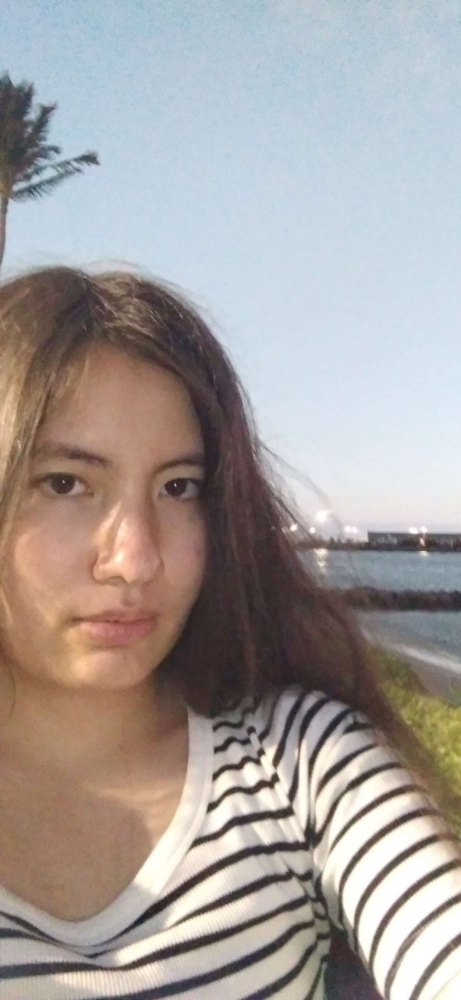
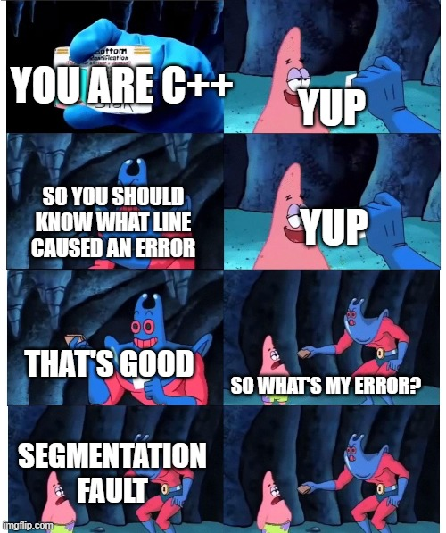

> "Programming isn't about what you know; it's about what you can figure out."
**Chris Pine, "Learn to Program"**
# Introduction
```
public class UserPage{	
	public static void main(String args[]){
		System.out.println("Welcome to my user page!);
	}
}	
```


Hello! I'm Isabelle Layon, a Computer Science student at UCSD. I am interested in Software Development and UI Design, along with programming for
Arduino and on Raspberry Pi.

## Programming
Throughout my courses, I have learned and continue to study several programming languages. I currently have learned/am learning:
* Java
* Python
* C++
* C

Besides my courses, I have experienced programming and wiring robots during the UCSD COSMOS program in July 2021, and programming a [mini self driving Arduino
robot](arduinoproject.jpg) for a high school project in 2022. 

## Future Goals
-[ ] Learn HTML
-[ ] Learn how to create a website
-[ ] Add 2 projects to my resume
-[ ] Land an internship

## End


This site was built using [GitHub Pages](https://pages.github.com/).

